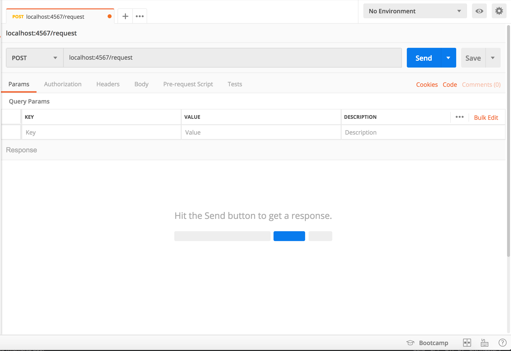
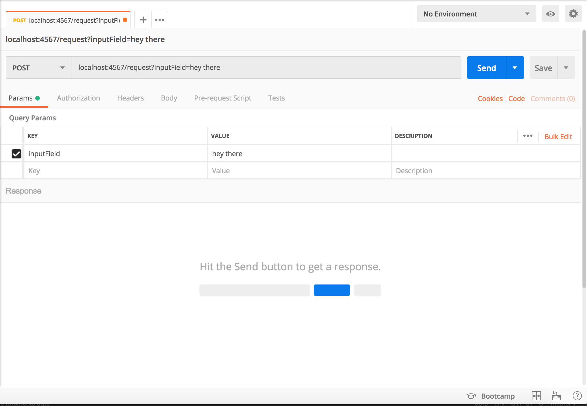

# How to Build a Simple Microservice
### What is a Microservice?

The formal definition can be found [here](https://en.wikipedia.org/wiki/Microservices)

In simplest terms, imagine breaking down a large application into a bunch of smaller applications, each of which have a specific task.
* For example, I may build a microservice just to deal with authentication tokens and verifying them  

Microservices generally communicate based on HTTP requests. 
There can be a lot of benefits to using microservices, but I'll save that for a later discussion. For now, let's get into how to quickly build one!

## Technical Information
Built using Maven and Java 8. 
Built using Java Spark framework [found here](http://sparkjava.com/)

## Let's Go!
To launch the application, run the Application.java class.

* A server is now started on localhost:4567.
* As defined in our WebServer.java class, we have a /request route that we can send information to.

For this example, we will be using Postman to send requests to our microservice.

Let's start by entering that URL we have above. In this case, it would be localhost:4567/request

Great. Now that we are sending a request to the "/request" route on our microservice, let's add in some query parameters.
* As defined in our RequestRoute.java, we will be using the 'inputField' parameter in this example

Awesome. Now we are ready to send the data! Hit send and checkout the request!
* The request we received is the inputField backwards. In RequestRoute, we pass the information into MyController and then return to the user their input backwards.

## What's the Point of This?
Yeah, reversing a string might not be your end goal. Luckily, microservices can be nearly anything you want. For example, try making an
 authentication server which takes in requests and returns a 'token' assigned to that user. The possibilities are endless.